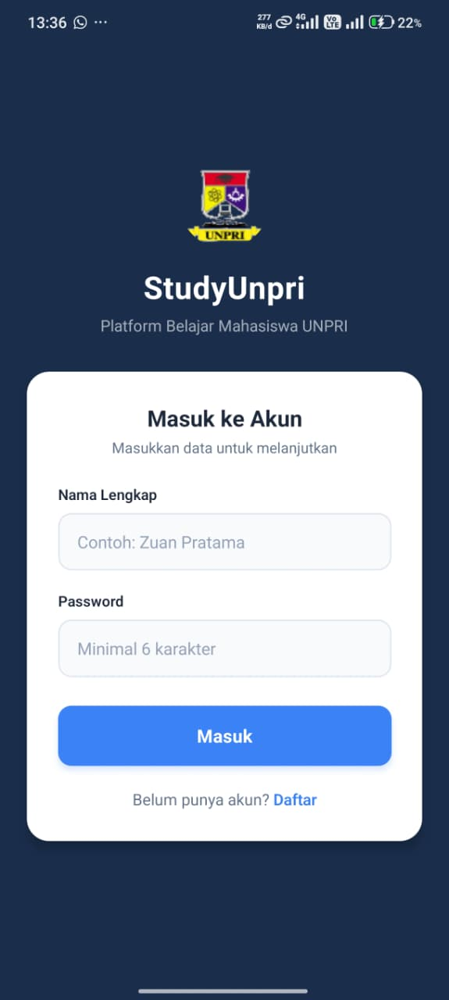
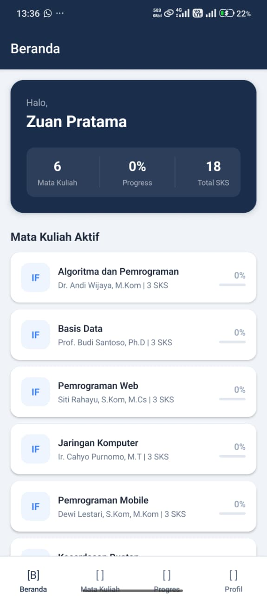
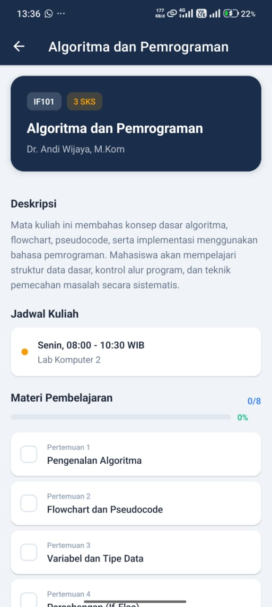
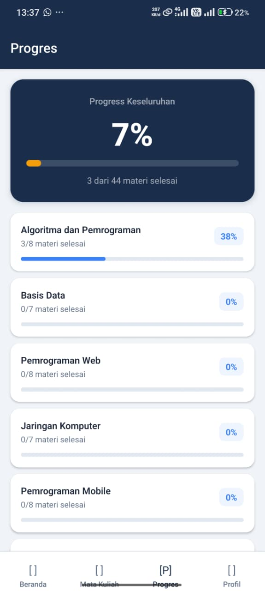
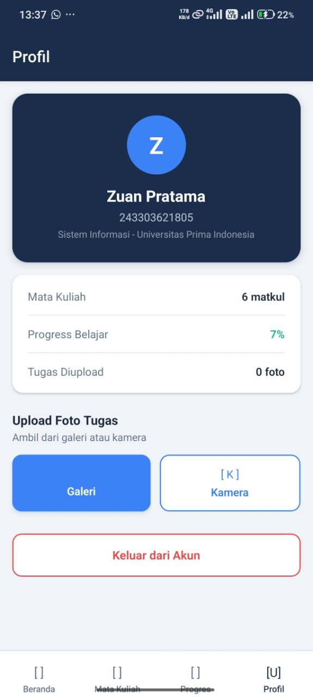

# StudyUnpri — Domain B: E-Learning Kampus


> Aplikasi platform belajar online kampus untuk mahasiswa Universitas Prima Indonesia. Mahasiswa dapat melihat daftar mata kuliah, memantau progress belajar per materi, dan mengupload foto tugas melalui kamera atau galeri.

---

## Screenshots

| Login Screen | Home Screen | Detail Matkul |
|:---:|:---:|:---:|
|  |  |  |

| Progress Screen | Profil Screen |
|:---:|:---:|
|  |  |

---

## Fitur Utama

- [x] Login/Register dengan validasi form (nama, NIM, password)
- [x] Daftar Mata Kuliah dengan FlatList + dummy data JSON
- [x] Detail matkul: deskripsi, jadwal, ruang, materi
- [x] Checklist progress belajar per materi (tersimpan di AsyncStorage)
- [x] Upload foto tugas via expo-image-picker (galeri dan kamera)
- [x] Data persisten dengan AsyncStorage (user session + progress + tugas)
- [x] Bottom Tab Navigation (Beranda, Matkul, Progres, Profil) + Stack Navigator
- [x] Loading state dengan ActivityIndicator
- [x] Empty state component
- [x] Conditional rendering (loading/empty/data)

---

## Tech Stack

| Layer | Teknologi |
|-------|-----------|
| Framework | React Native + Expo SDK 52 |
| Navigation | React Navigation v7 (Native Stack + Bottom Tab) |
| Storage | @react-native-async-storage/async-storage |
| Device | expo-image-picker (kamera + galeri) |
| Build | EAS Build (Expo Application Services) |

---

## Cara Menjalankan

```bash
git clone https://github.com/username/studyunpri.git
cd studyunpri
npm install
npx expo start
```

Scan QR Code dengan Expo Go di HP.

---

## Download APK

[Download APK terbaru](LINK_APK_GITHUB_RELEASE_ATAU_DRIVE)

---

## Expo Snack

[Buka di Expo Snack](LINK_EXPO_SNACK)

---

## Developer

**Zuan Pratama** | 243303621805 | Kelas 4B
Universitas Prima Indonesia — Prodi Sistem Informasi
Mata Kuliah: Pemrograman Mobile (React Native)
